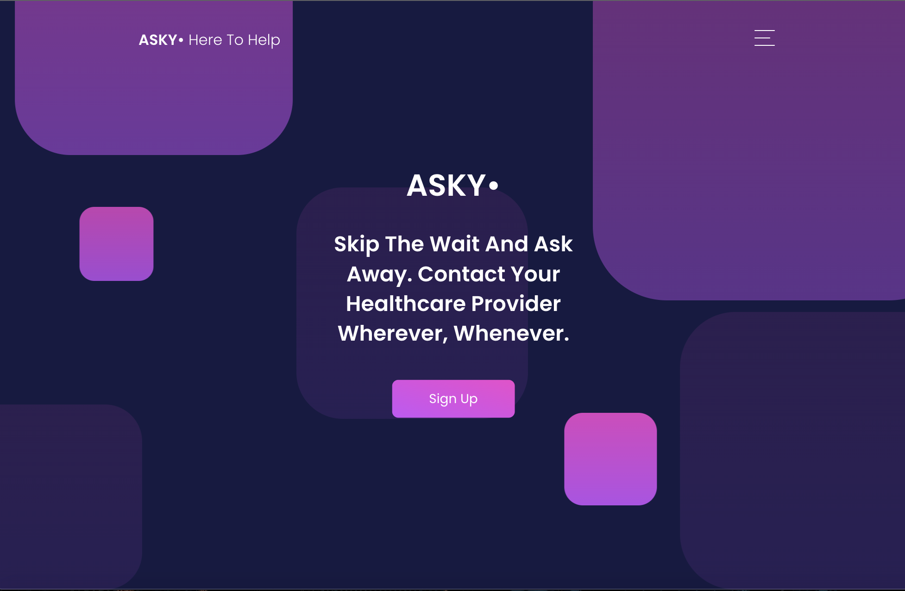

</img>

# Introduction

Asky helps busy medical clinics attend to patient inquiries in an organized way.

---

# Objectives

My main objective was to create a full-stack medical inquiry app that was easy for patients to navigate while prioritizing organization on the clinic side. I aimed to provide a solution to help busy clinics attend to the ever-increasing needs of patients in a way that allowed for organization. 

---

# Who is this for? 

This app is for medical clinics that want to decrease the volume of patient phone calls by providing a user-friendly way for patients to reach the medical clinic asynchronously. 

---

# Optimizations 

  These are some of the optimizations I am currently implementing :
  
- I am in the process of converting EJS to React.
- I am currently designing the medical clinic dashboard and implementing the organizational functionality.
- I want to change the UI to something lighter.
- General optimizations for progressive rendering
- Eventually, I want to incorporate the Twilio API

---

# Tech used 

JavaScript, MongoDB, Express, Node, CSS, EJS, Passport

---

# Packages/Dependencies used 

bcrypt, connect-mongo, dotenv, ejs, express, express-flash, express-session, mongodb, mongoose, morgan, nodemon, passport, passport-local, validator

---

# Install all the dependencies or node packages used for development via Terminal

`npm install` 

---

# Things to add

- Create a `.env` file under the config folder and add the following as `key: value` 
  - PORT: 2121 (can be any port example: 3000) 
  - DB_STRING: `your database URI` 
 ---